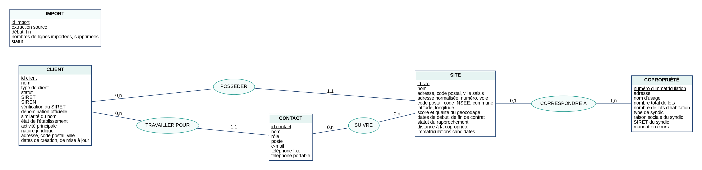
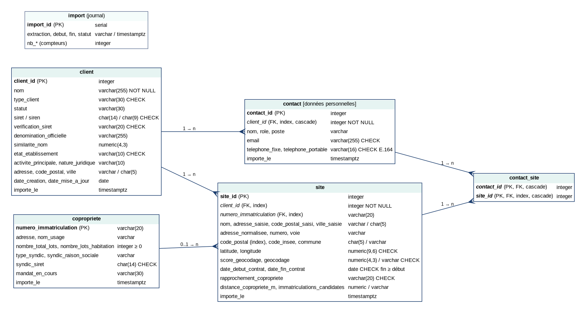

# Modèle de données du référentiel clients (C4)

Méthode Merise : modèle conceptuel (MCD), logique (MLD) puis physique (MPD), à partir des données préparées par l'agrégation (`docs/AGREGATION.md`).

## Règles de gestion

| N° | Règle | Conséquence dans le modèle |
|---|---|---|
| RG1 | Un client possède zéro, un ou plusieurs sites ; un site appartient à un seul client | POSSÉDER : CLIENT (0,n) — SITE (1,1) |
| RG2 | Un contact travaille pour un seul client ; un client a zéro, un ou plusieurs contacts | TRAVAILLER POUR : CLIENT (0,n) — CONTACT (1,1) |
| RG3 | Un contact suit zéro, un ou plusieurs sites ; un site est suivi par zéro, un ou plusieurs contacts (constat du 06/10 : une même personne suit jusqu'à plusieurs dizaines de sites) | SUIVRE : CONTACT (0,n) — SITE (0,n), association porteuse de la table `contact_site` |
| RG4 | Un site correspond au plus à une copropriété immatriculée ; une copropriété n'est conservée que si au moins un site lui correspond | CORRESPONDRE À : SITE (0,1) — COPROPRIÉTÉ (1,n) |
| RG5 | Le client est-il le syndic de la copropriété ? Information **dérivée** (SIREN du client = 9 premiers chiffres du SIRET du syndic), jamais stockée | Calculée par la vue `v_site` |
| RG6 | Chaque import est tracé (source, dates, compteurs, statut), sans lien avec les données importées | Entité isolée IMPORT |

## MCD

Source : `docs/merise/mcd.dot` (Graphviz). Identifiants soulignés.

## MLD

Notation : clé primaire en **gras**, clé étrangère précédée de `#`.

- client (**client_id**, nom, type_client, statut, siret, siren, verification_siret, denomination_officielle, similarite_nom, etat_etablissement, activite_principale, nature_juridique, adresse, code_postal, ville, date_creation, date_mise_a_jour, importe_le)
- copropriete (**numero_immatriculation**, adresse, nom_usage, nombre_total_lots, nombre_lots_habitation, type_syndic, syndic_raison_sociale, syndic_siret, mandat_en_cours, importe_le)
- site (**site_id**, #client_id, #numero_immatriculation, nom, adresse_saisie, code_postal_saisi, ville_saisie, adresse_normalisee, numero, voie, code_postal, code_insee, commune, latitude, longitude, score_geocodage, geocodage, date_debut_contrat, date_fin_contrat, rapprochement_copropriete, distance_copropriete_m, immatriculations_candidates, importe_le)
- contact (**contact_id**, #client_id, nom, role, poste, email, telephone_fixe, telephone_portable, importe_le)
- contact_site (**#contact_id, #site_id**)
- import (**import_id**, extraction, debut, fin, nb_clients, nb_sites, nb_coproprietes, nb_contacts, nb_contacts_sites, nb_supprimes, statut)

Passage MCD → MLD : les associations (1,1)–(0,n) donnent une clé étrangère du côté (1,1) (`site.client_id`, `contact.client_id`) ; l'association (0,1)–(1,n) donne une clé étrangère facultative (`site.numero_immatriculation`) ; l'association (0,n)–(0,n) SUIVRE devient la table `contact_site`, dont la clé primaire est composée des deux clés étrangères. Les attributs du rapprochement (statut, distance) dépendent du site et restent dans `site`.

## MPD

Le MPD exécutable est `sql/referentiel/01_schema.sql` (PostgreSQL 16). Il ajoute au MLD :
- **types et contraintes** reprenant les règles de nettoyage : SIRET à 14 chiffres et SIREN cohérent avec le SIRET, codes postaux à 5 chiffres, téléphones au format E.164, e-mails valides, coordonnées bornées à la métropole, listes de valeurs (`CHECK ... IN`), date de fin de contrat postérieure au début, un contact a au moins une coordonnée, numéro d'immatriculation renseigné si et seulement si le rapprochement l'est ;
- **intégrité référentielle** : suppression en cascade des contacts d'un client et des associations d'un contact ou d'un site ; un site ne peut pas exister sans son client ;
- **index** sur toutes les clés étrangères (jointures de l'API, suppressions en cascade) et sur `site.code_postal` (filtre de l'API) ;
- la **vue `v_site`** (site, client, copropriété et RG5) ;
- les **commentaires** signalant les colonnes de données personnelles ;
- deux **comptes de moindre privilège** (`sql/referentiel/02_roles.sh`) : `referentiel_import` (écriture, script d'import) et `referentiel_api` (lecture seule, API).

**Intégration sans erreur.** Les deux scripts sont exécutés automatiquement à la création de la base (conteneur `referentiel-db`, dossier `/docker-entrypoint-initdb.d`) et, à chaque pull request, par la CI sur une base PostgreSQL 16 vide (`tests/test_integration_referentiel.py`).

## Choix de la base de données

| Critère | Besoin du référentiel | PostgreSQL 16 |
|---|---|---|
| Modèle | Données relationnelles (clés étrangères, association n:n), volume modeste | SGBD relationnel, intégrité référentielle et contraintes `CHECK` |
| Qualité des données | Formats imposés dès l'écriture | Expressions régulières dans les contraintes |
| Cohérence d'un import | Tout ou rien | Transactions ACID |
| Exploitation | Une seule personne pour maintenir ; serveur déjà en place | Même SGBD et même version que Nexo : mêmes outils de sauvegarde, de supervision et de maintenance |
| Coût | TPE | Logiciel libre, image Docker officielle |

Écartés : SQLite (pas de comptes ni d'accès concurrent pour l'API), une base orientée documents (les données sont fortement liées et leur schéma est stable), l'ajout de tables dans la base de Nexo (le référentiel est un service distinct, avec ses propres comptes, son cycle de vie et ses règles de conservation).
